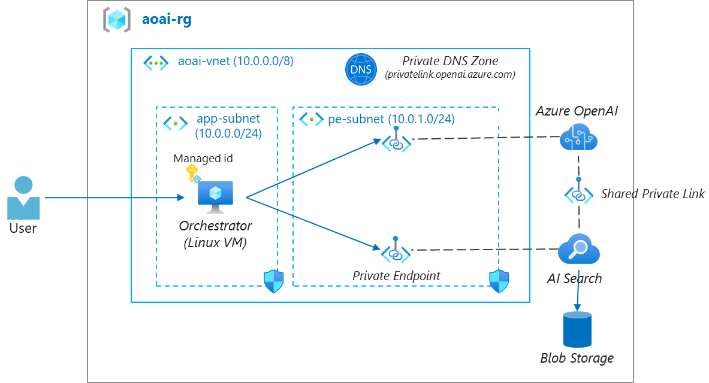

# Secure Deployment

Setup secure deployment environment for Azure OpenAI based app.



## Access Token

1. Setup managed identity on a VM

- https://learn.microsoft.com/en-us/entra/identity/managed-identities-azure-resources/qs-configure-portal-windows-vm
- https://learn.microsoft.com/en-us/entra/identity/managed-identities-azure-resources/how-to-use-vm-token

2. Assign role to your managed identity

> You need to assign `Cognitive Services OpenAI User` and `Search Index Data Reader` roles to your managed identity

- https://learn.microsoft.com/en-us/entra/identity/managed-identities-azure-resources/howto-assign-access-portal

3. Update code to get access token

For AOAI:

```
# Entra ID authentication with Managed ID
import os
from openai import AzureOpenAI
from azure.identity import DefaultAzureCredential, get_bearer_token_provider

client = AzureOpenAI(
    azure_endpoint=os.environ['AOAI_ENDPOINT'],
    azure_ad_token_provider=get_bearer_token_provider(DefaultAzureCredential(), "https://cognitiveservices.azure.com/.default"),
    api_version="2023-12-01-preview",
)
```

For Azure AI Search:

> !Make sure that you enable both keys and RBAC API access.
> https://learn.microsoft.com/en-us/azure/search/search-security-rbac

```
# Entra ID authentication with Managed ID
from azure.identity import DefaultAzureCredential
import os

endpoint = os.environ["AZSCH_ENDPOINT"]
credential = DefaultAzureCredential()
```

## Private Access

For Azure AI Services:

- https://learn.microsoft.com/en-us/azure/ai-services/cognitive-services-virtual-networks?tabs=portal

To connect OpenAI service (P.E enabled) from AI Search, you need to setup Private Link Service

- https://learn.microsoft.com/en-us/azure/search/search-indexer-howto-access-private


