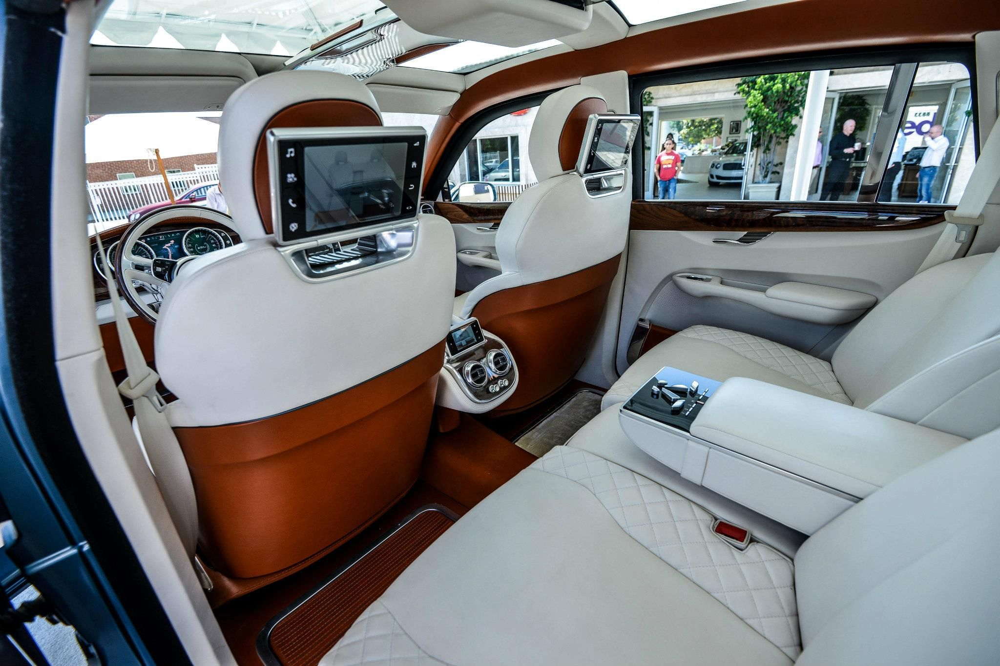
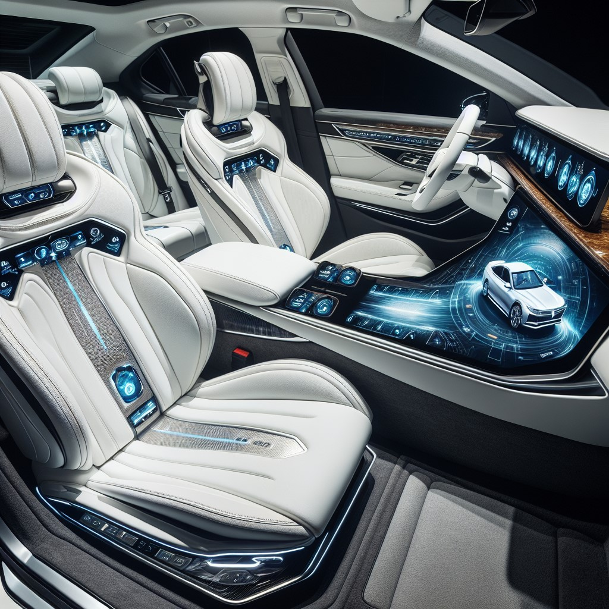

# Generating the right image

Generating the desired image using generative AI models, such as OpenAI’s Dall-e, can be challenging. The output images often do not align with the user’s expectations or the images they had envisioned.

__User's expectation__:




__Result__:

```
Prompt: Interior of a luxury car with white seat and screen on the back of the front seat.
```



The reason is that models like Dall-e require a very detailed and precise description of the image to be generated. To overcome this challenge, one could consider reverse engineering the prompt from a similar image that they intend to generate using a generative AI model like GPT-4.

## Solution

1. Search for an image similar to the one you intend to generate.
    - Image Searching: Search image by text or image using [Azure AI Vision](https://azure.microsoft.com/en-us/products/ai-services/ai-vision/).
2. Reverse engineer the prompt from the image you've selected.
    - Reverse engineer the image prompt (or generating dalle prompt) using the vision capability of OpenAI GPT-4o.
3. Modify the prompt and generate the image.
    - Generate image using OpenAI Dall-e with modified/update prompt.