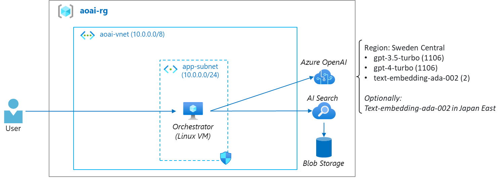

# Workshop: Azure OpenAI for AI Developers

This repo contains challenges and solutions for Azure OpenAI for AI Developers workshop.

## Setup



Provision following Azure resources:

- VM (Linux Ubuntu 22.04 LTS) and VNnet
- Azure Blob Storage
- Azure AI Search
- Azure OpenAI and deploy 3 models
    - gpt-3.5-turbo (1106)
    - gpt-4-turbo (1106)
    - text-embedding-ada-002 (2)

Setup VM

- install `miniconda`
    - https://docs.anaconda.com/free/miniconda/index.html#quick-command-line-install 
- setup a new conda (python=3.9) environment
    ```
    conda create -n myenv python=3.9
    conda activate myenv
    ```
- install packages
    - `pip install -r requirements.txt`
- update `.env`
    - copy `env.txt` to `.env` and update keys
- setup/run jupyter
    - `jupyter notebook`

## Challenges:

1. Document retrieve - Preparation
    - do chunking & indexing documents
        - built-in chunking and indexing (portal)
        - manual chunking using Langchain and push indexing

2. Document retrieve - Search Query
    - compare types of search method
        - vector
        - hybrid (vector + keyword)
        - semantic ranking

3. AI Orchestration - RAG Basic
    - implement simple Q&A bot with basic RAG pattern
        - query -> embedding -> search (topK) -> basic prompt -> answer
      
4. AI Orchestration - RAG Advance
    - implement improved Q&A bot with advanced RAG pattern
        - query -> chat history + rewrite query(LLM)-> embedding -> search (topK) -> adv prompt -> answer

5. Secure Deployment
    - implement token acess and network security 
        - change to token access using managed identity
        - setup `Private Endpoint`
